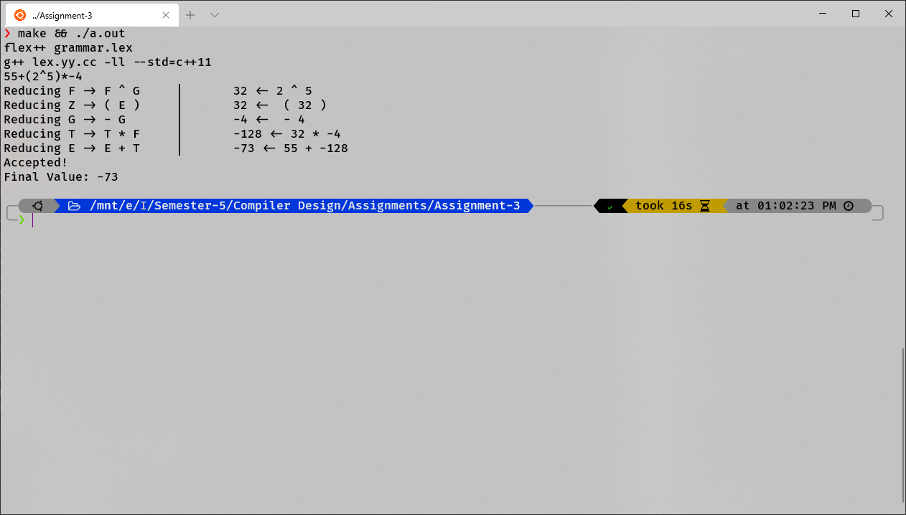

# CD Assignment-3 Report

**Name: Ashutosh Chauhan**
**Roll No: S20180010017**

### Lexical Analysis

I used `flex/flex++` to create lexical analyzer which returned defined token.

```flex
NUM [0-9]+
ADD \+
MUL \*
POW \^
MINUS \-
PARASTART \(
PARAEND \)
WS       [ \t]
```

The file `clr_table.cpp` contains the coded CLR Parse table and more details about the Productions.

The file `clr_parse.cpp` contains the implementation of parser using the CLR parsing table and postfix SDT.

### Modified Grammar

1. `L -> E`
2. `E -> E + T` 
3. `E -> T`
4. `T -> T \* F` 
5. `T -> F`
6. `F -> F ^ G`
7. `F -> G`
8. `G -> - G`
9. `G -> Z`
10. `Z ->( E )`
11. `Z -> n`

### Modified SDT

1. `L -> E`	           `{L.val = E.val}`
2. `E -> E + T`      `{E.val = E1.val + T.val} `
3. `E -> T`              `{E.val = T.val}`
4. `T -> T \* F`     `{T.val = T1.val * F.val}`
5. `T -> F`               ` {T.val = F.val}`
6. `F -> F ^ G`       `{F.val = F1.val ^ G.val}`
7. `F -> G`               `{F.val = G.val}`
8. `G -> - G`           `{G.val = -1 * Z.val}`
9. `G -> Z`               `{G.val = Z.val}`
10. `Z ->( E )`         `{Z.val = E.val}`
11. `Z -> n`               `{Z.val = num.lex_val}`

### LR(1) Automaton


### CLR LR(1) Parse Table

| State | ACTION | ACTION | ACTION | ACTION | ACTION | ACTION | ACTION | GOTO | GOTO | GOTO | GOTO | GOTO | GOTO | GOTO |
| ----- | ------ | ------ | ------ | ------ | ------ | ------ | ------ | ---- | ---- | ---- | ---- | ---- | ---- | ---- |
| +     | *      | ^      | -      | (      | )      | n      | $      | L    | E    | T    | F    | G    | Z    |      |
| 0     |        |        |        | s5     | s7     |        | s8     |      |      | 1    | 2    | 3    | 4    | 6    |
| 1     | s9     |        |        |        |        |        |        | acc  |      |      |      |      |      |      |
| 2     | r2     | s10    |        |        |        |        |        | r2   |      |      |      |      |      |      |
| 3     | r4     | r4     | s11    |        |        |        |        | r4   |      |      |      |      |      |      |
| 4     | r6     | r6     | r6     |        |        |        |        | r6   |      |      |      |      |      |      |
| 5     |        |        |        | s5     | s7     |        | s8     |      |      |      |      |      | 12   | 6    |
| 6     | r8     | r8     | r8     |        |        |        |        | r8   |      |      |      |      |      |      |
| 7     |        |        |        | s17    | s19    |        | s20    |      |      | 13   | 14   | 15   | 16   | 18   |
| 8     | r10    | r10    | r10    |        |        |        |        | r10  |      |      |      |      |      |      |
| 9     |        |        |        | s5     | s7     |        | s8     |      |      |      | 21   | 3    | 4    | 6    |
| 10    |        |        |        | s5     | s7     |        | s8     |      |      |      |      | 22   | 4    | 6    |
| 11    |        |        |        | s5     | s7     |        | s8     |      |      |      |      |      | 23   | 6    |
| 12    | r7     | r7     | r7     |        |        |        |        | r7   |      |      |      |      |      |      |
| 13    | s25    |        |        |        |        | s24    |        |      |      |      |      |      |      |      |
| 14    | r2     | s26    |        |        |        | r2     |        |      |      |      |      |      |      |      |
| 15    | r4     | r4     | s27    |        |        | r4     |        |      |      |      |      |      |      |      |
| 16    | r6     | r6     | r6     |        |        | r6     |        |      |      |      |      |      |      |      |
| 17    |        |        |        | s17    | s19    |        | s20    |      |      |      |      |      | 28   | 18   |
| 18    | r8     | r8     | r8     |        |        | r8     |        |      |      |      |      |      |      |      |
| 19    |        |        |        | s17    | s19    |        | s20    |      |      | 29   | 14   | 15   | 16   | 18   |
| 20    | r10    | r10    | r10    |        |        | r10    |        |      |      |      |      |      |      |      |
| 21    | r1     | s10    |        |        |        |        |        | r1   |      |      |      |      |      |      |
| 22    | r3     | r3     | s11    |        |        |        |        | r3   |      |      |      |      |      |      |
| 23    | r5     | r5     | r5     |        |        |        |        | r5   |      |      |      |      |      |      |
| 24    | r9     | r9     | r9     |        |        |        |        | r9   |      |      |      |      |      |      |
| 25    |        |        |        | s17    | s19    |        | s20    |      |      |      | 30   | 15   | 16   | 18   |
| 26    |        |        |        | s17    | s19    |        | s20    |      |      |      |      | 31   | 16   | 18   |
| 27    |        |        |        | s17    | s19    |        | s20    |      |      |      |      |      | 32   | 18   |
| 28    | r7     | r7     | r7     |        |        | r7     |        |      |      |      |      |      |      |      |
| 29    | s25    |        |        |        |        | s33    |        |      |      |      |      |      |      |      |
| 30    | r1     | s26    |        |        |        | r1     |        |      |      |      |      |      |      |      |
| 31    | r3     | r3     | s27    |        |        | r3     |        |      |      |      |      |      |      |      |
| 32    | r5     | r5     | r5     |        |        | r5     |        |      |      |      |      |      |      |      |
| 33    | r9     | r9     | r9     |        |        | r9     |        |      |      |      |      |      |      |      |

### Result

Running example prints reductions made and final output.




