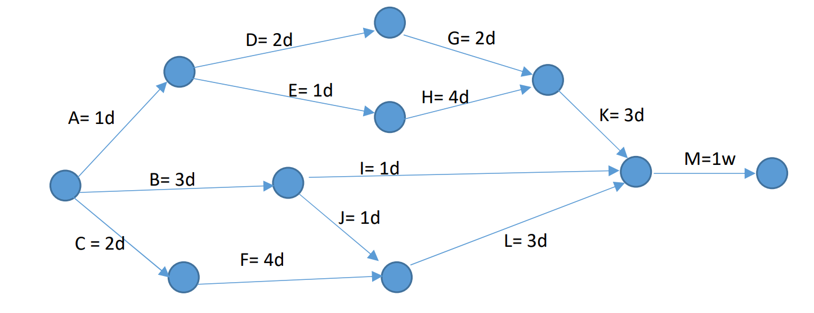
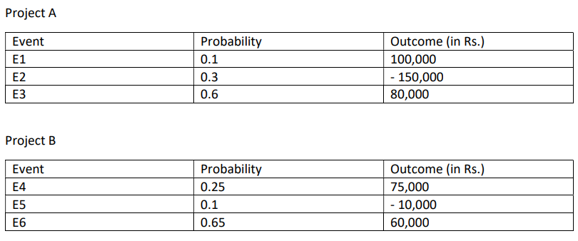

# Assignment

Ashutosh Chauhan

Roll No: S20180010017

## Q.1

#### Critical path(s)

* A -> E -> H -> K -> M
* C -> F -> L -> M

#### Critical tasks

* A
* C
* E
* F
* H
* K
* L
* M

#### Calculate the project end date

​	Considering Saturday and Sunday as non-working days.

​	November 24th 2020.

#### For each task calculate and fill the table

| Task | Early Start   | Early Finish  | Late Start    | Late Finish   | Free Float(days) | Total Float(days) |
| ---- | ------------- | ------------- | ------------- | ------------- | ---------------- | ----------------- |
| A    | November 2nd  | November 3rd  | November 2nd  | November 3rd  | 0                | 0                 |
| B    | November 2nd  | November 5th  | November 4th  | November 9th  | 0                | 2                 |
| C    | November 2nd  | November  4th | November 2nd  | November  4th | 0                | 0                 |
| D    | November 3rd  | November 5th  | November 4th  | November 6th  | 0                | 1                 |
| E    | November 3rd  | November 4th  | November 3rd  | November 4th  | 0                | 0                 |
| F    | November  4th | November 10th | November  4th | November 10th | 0                | 0                 |
| G    | November 5th  | November 9th  | November 6th  | November 10th | 1                | 1                 |
| H    | November 4th  | November 10th | November 4th  | November 10th | 0                | 0                 |
| I    | November 5th  | November 6th  | November 12th | November 13th | 5                | 5                 |
| J    | November 5th  | November 6th  | November 9th  | November 10th | 2                | 2                 |
| K    | November 10th | November 13th | November 10th | November 13th | 0                | 0                 |
| L    | November 10th | November 13th | November 10th | November 13th | 0                | 0                 |
| M    | November 13th | November 24th | November 13th | November 24th | 0                | 0                 |

## Q.2 Calculate EMV of projects A and B and determine favorable project

$$
EMV(Project\ A) = \Sigma (probability * Outcome)  \\
EMV(Project\ A) = 0.1 * 100,000 + 0.3 * -150,000 + 0.6 * 80,000 = ₹13,000
$$

$$
EMV(Project\ B) = \Sigma (probability * Outcome)  \\
EMV(Project\ B) = 0.25 * 75,000 + 0.1 * -10,000 + 0.65 * 60,000 = ₹56,750
$$

​	Project A is much more favorable than Project B, Since the EMV is less.